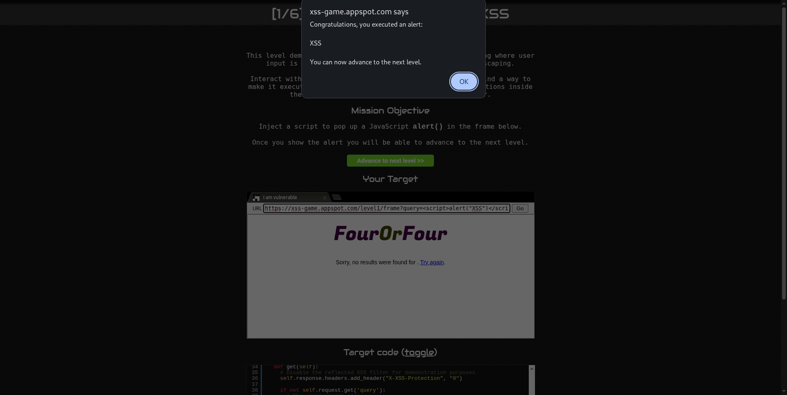
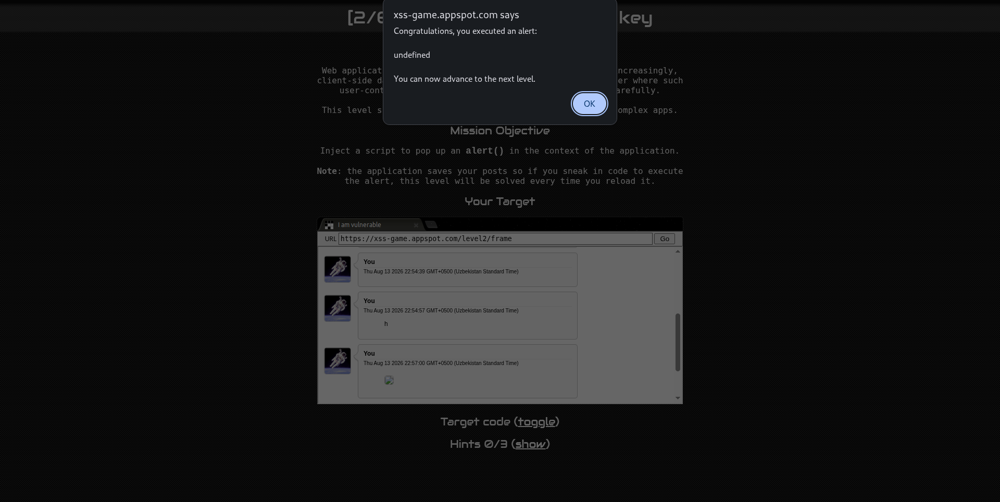
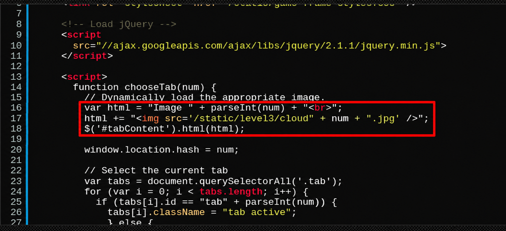
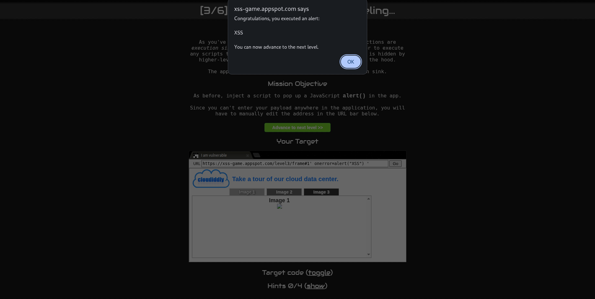
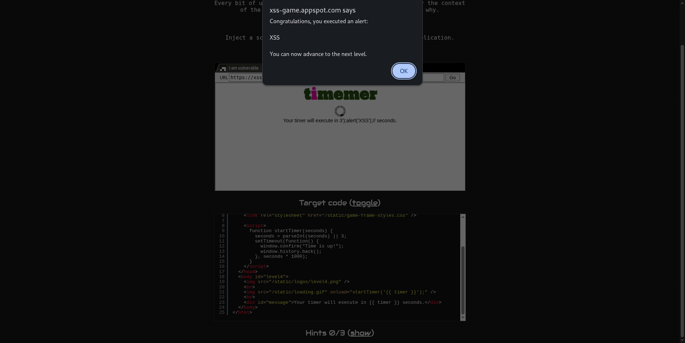
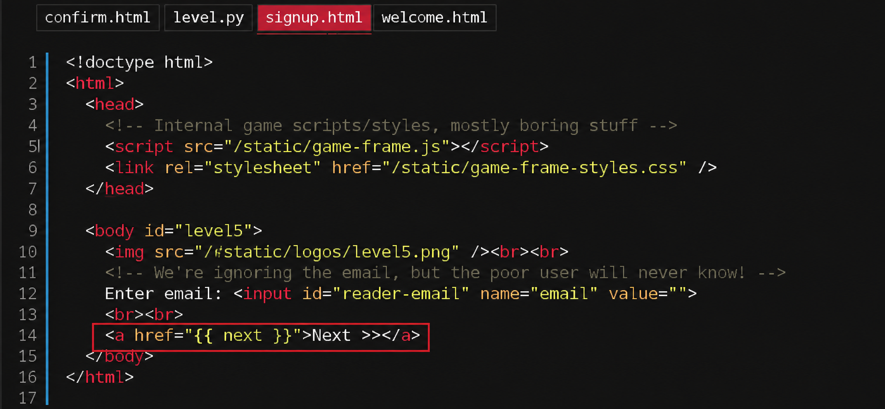
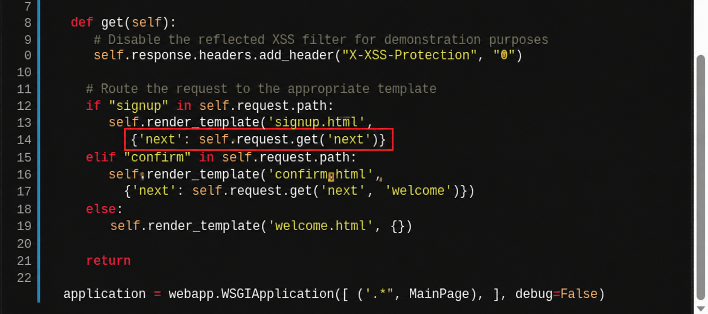
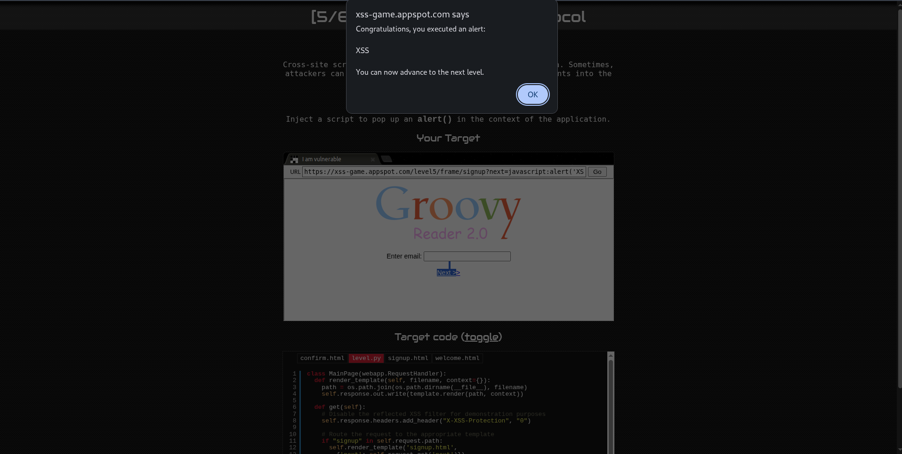

# Level 1 – Hello, World of XSS

## Zaiflik turi: Reflected XSS

Ushbu darajada source code tahlil qilinib, XSS zaifligi aniqlandi.

Payload: 

``` <script>alert("XSS")</script> ```

Payload yuborilganda, input hech qanday escaping qilinmasdan HTML kod sifatida qaytarildi. Natijada brauzer JavaScript kodini bajarib, alert("XSS") oynasini chiqardi.



# Level 2 

## Zaiflik turi: Stored XSS

Ushbu darajada source code tahlil qilinib, foydalanuvchi kiritgan ma'lumot `innerHTML` orqali sahifaga joylashtirilishi aniqlandi.

Kodning zaif qismi:

```
var html = "<blockquote>" + posts[i].message + "</blockquote>";
containerEl.innerHTML += html;
```
Bu yerda `posts[i].message` foydalanuvchi tomonidan boshqariladi va `innerHTML` orqali HTML sifatida qayta ishlanadi.

Avval ushbu payload sinab ko'rildi: 
``` <script>alert("XSS")</script> ```
`<script> ishlamagani sababli onerror event handleridan foydalanildi:`
```  ```



Payload yuborilgandan keyin post saqlandi, page ga qayta kirganda `alert()` chiqdi.

# Level 3 

## Zaiflik turi: DOM-based XSS

Bunda URL `num` qiymati JavaScript orqali olinib, innerHTML bilan sahifaga HTML sifatida joylashtiriladi.

Kodning zaif qismi:


```
var html = "Image " + parseInt(num) + "<br>";
html += "";
$('#tabContent').html(html);
```

Bu kodda num HTML ichiga to'g'ridan-to'g'ri qo'shiladi va .html() orqali render qilinadi.
Payload:
``` ' onerror=alert("XSS") ' ```



# Level 4

## Zaiflik turi: Reflected XSS

Server foydalanuvchi yuborgan timer qiymatini mana bu joyga qo'yadi:

``````

Timer kodi JavaScript context ichiga joylashtirilgan va maxsus belgilar escaping qilinmagan.

Payload:

``` 3');alert('XSS');// ```

Server tomonidan hosil qilingan HTML:

``````



# Level 5

## Zaiflik turi: Reflected XSS

1) signup.html faylida next parametri quyidagi href ichida ishlatilayotgani aniqlandi:

``` <a href="{{ next }}">Next >></a> ```



2) URL'dagi next parametri to'g'ridan-to'g'ri href ichiga tushadi

``` {'next': self.request.get('next', 'welcome')} ```



Ammo next qiymatini oddiy URL sifatida berish shart emas. HTML attribute ichiga JavaScript URL scheme kiritish mumkinligini tekshirish mumkin.
next parametri foydalanuvchidan olinib, xavfsiz tekshirilmasdan href attribute ichiga joylashtirilmoqda.

Payload:

``` javascript:alert('XSS') ```

payload ushbu ko'rinishda qo'shiladi:

```<a href="javascript:alert('XSS')">Next >></a>```



# Level 6
